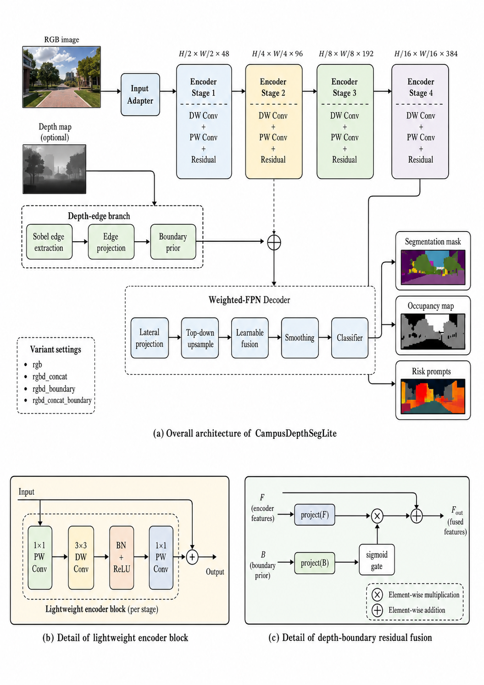
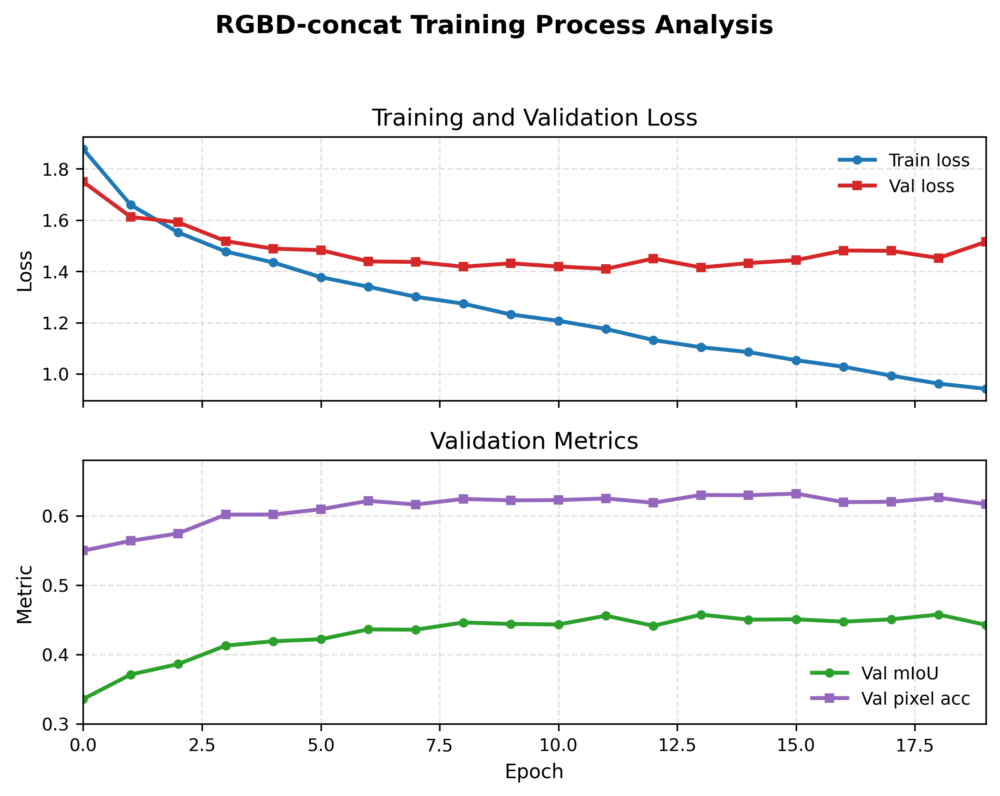
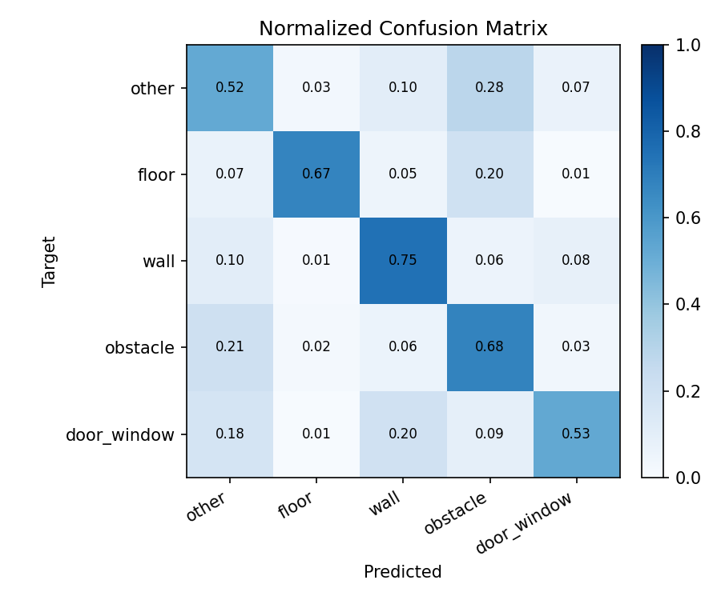
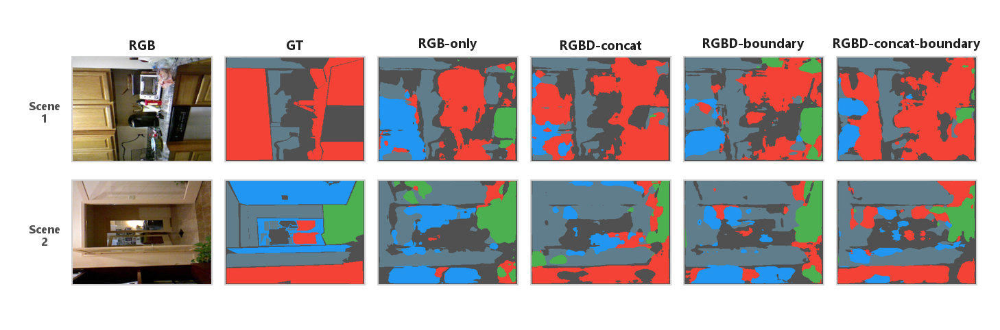
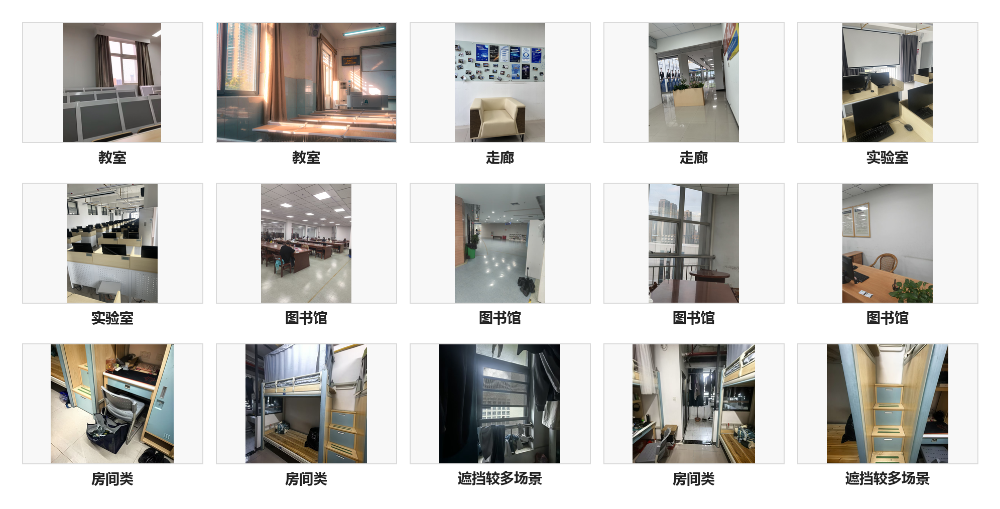

<p align="center">
  <strong>CampusDepthSegLite</strong>
</p>

<h1 align="center">校园室内巡检的轻量 RGB-D 语义分割与空间占用分析系统</h1>

<p align="center">
  基于 NYUDepthV2 的五类室内空间分割、RGB-D 融合消融实验与校园场景定性展示。
</p>

<p align="center">
  <a href="#项目简介">项目简介</a> ·
  <a href="#方法概览">方法概览</a> ·
  <a href="#实验结果">实验结果</a> ·
  <a href="#静态-web-展示页">Web Demo</a> ·
  <a href="#本地运行">本地运行</a>
</p>

---

## 项目亮点

| Best Model | Test mIoU | Dataset | Model Size |
| --- | ---: | --- | ---: |
| RGBD-concat | **0.4683** | NYUDepthV2, 1449 samples | about 1.51M params |

本项目为课程设计独立实现，不复制、导入或依赖任何个人研究代码、未公开工程代码或外部研究项目源码。项目中的数据处理、模型定义、训练流程、评估指标和可视化模块均为课程设计重新编写。

## 项目简介

CampusDepthSegLite 面向校园教室、走廊、实验室和公共空间等室内场景，完成轻量 RGB-D 语义分割与空间占用分析。系统输入 RGB 或 RGB-D 图像，输出五类语义分割结果，并结合地面可见率和障碍物占比生成巡检提示。

五类标签：

| ID | Class |
| ---: | --- |
| 0 | other |
| 1 | floor |
| 2 | wall |
| 3 | obstacle |
| 4 | door_window |

## 方法概览

CampusDepthSegLite 由三部分组成：

- `MiniHierarchicalEncoder`：四阶段轻量卷积编码器，输出多尺度特征。
- `WeightedFPNDecoder`：统一通道后进行多尺度上采样与可学习权重融合。
- `DepthBoundaryResidualFusion`：可选深度边界残差融合模块，用 Sobel depth edge 注入多尺度特征。

<p align="center">
  
</p>

<p align="center"><em>CampusDepthSegLite 网络结构图</em></p>

## 实验结果

四组实验均使用相同的 NYUDepthV2 五类标签划分。整体结果表明，`RGBD-concat` 取得最佳 mIoU、Pixel Acc 和 Mean Acc；`RGBD-concat-boundary` 在 obstacle 类上有一定优势，但整体没有超过 `RGBD-concat`。

| 方法 | 输入 | 融合方式 | mIoU | Pixel Acc | Mean Acc |
| --- | --- | --- | ---: | ---: | ---: |
| RGB-only | RGB | none | 0.4226 | 0.5964 | 0.5881 |
| **RGBD-concat** | RGB + Depth | direct concat | **0.4683** | **0.6318** | **0.6294** |
| RGBD-boundary | RGB + Depth | depth edge residual | 0.4206 | 0.5974 | 0.5925 |
| RGBD-concat-boundary | RGB + Depth | concat + depth edge residual | 0.4605 | 0.6271 | 0.6191 |

训练输出、checkpoint、原始数据和生成的报告素材不纳入 Git 管理。定量实验结果汇总见 [EXPERIMENT_RESULTS.md](EXPERIMENT_RESULTS.md)。

## 可视化结果

<table>
  <tr>
    <td width="50%">
      
      <br>
      <sub>RGBD-concat 训练损失与验证指标曲线</sub>
    </td>
    <td width="50%">
      
      <br>
      <sub>最佳模型归一化混淆矩阵</sub>
    </td>
  </tr>
  <tr>
    <td colspan="2">
      
      <br>
      <sub>四种方法预测结果对比</sub>
    </td>
  </tr>
</table>

## 自采集校园场景展示

自采集校园图片没有像素级 GT，也没有真实 depth，仅用于真实场景下的定性展示，不参与训练、验证、测试或定量评价，不计算 mIoU、Pixel Acc 或 Mean Acc。该部分默认使用 RGB-only checkpoint 展示 Prediction mask、Occupancy map、Risk boxes 和风险提示。

<p align="center">
  
</p>

<p align="center"><em>自采集校园场景样例总览</em></p>

## 静态 Web 展示页

项目提供了一个轻量静态展示页，用于集中展示模型结构、实验结果、训练曲线和自采集校园场景定性结果。

- 入口文件：[web_demo/index.html](web_demo/index.html)
- 样式文件：[web_demo/style.css](web_demo/style.css)
- 页面说明：[web_demo/README.md](web_demo/README.md)

该页面是纯静态 HTML，不做在线推理，不加载 checkpoint，不需要服务器或 GPU。下载项目后可直接双击 `web_demo/index.html` 本地查看。

## 项目结构

```text
campus-depthseg-lite/
  README.md
  EXPERIMENT_RESULTS.md
  requirements.txt
  scripts/
  src/
    datasets/
    models/
    lightning/
    utils/
  tests/
  web_demo/
    index.html
    style.css
    README.md
    assets/
```

`data/`、`outputs/`、`lightning_logs/`、`wandb/`、checkpoint 和本地大文件均被 `.gitignore` 忽略。

## 本地运行

安装依赖：

```bash
pip install -r requirements.txt
```

基础检查：

```bash
python -m compileall src scripts tests
pytest -q
python scripts/smoke_forward.py --device cpu
```

测试集评估：

```bash
python scripts/evaluate.py --data_dir data/nyu5 --split_file data/nyu5/splits/test.txt --checkpoint outputs/runs/exp02_rgbd_concat_e20/checkpoints/best.ckpt --variant rgbd_concat --batch_size 4 --accelerator cpu --devices 1
```

自采集场景展示：

```bash
python scripts/predict_campus_demo.py --rgb_dir data/campus_demo/rgb --checkpoint outputs/runs/exp01_rgb_e20/checkpoints/best.ckpt --variant rgb --out_dir outputs/report_assets/campus_demo --num_samples 8
```

数据集、checkpoint 和 outputs 不随仓库提交，需要本地准备。

## 训练命令示例

RGB-only baseline：

```bash
python scripts/train.py --data_dir data/nyu5 --variant rgb --experiment_name exp01_rgb_e20 --accelerator gpu --devices 1 --batch_size 4 --max_epochs 20
```

RGBD-concat：

```bash
python scripts/train.py --data_dir data/nyu5 --variant rgbd_concat --experiment_name exp02_rgbd_concat_e20 --accelerator gpu --devices 1 --batch_size 4 --max_epochs 20
```

RGBD-boundary：

```bash
python scripts/train.py --data_dir data/nyu5 --variant rgbd_boundary --experiment_name exp03_rgbd_boundary_e20 --accelerator gpu --devices 1 --batch_size 4 --max_epochs 20
```

RGBD-concat-boundary：

```bash
python scripts/train.py --data_dir data/nyu5 --variant rgbd_concat_boundary --experiment_name exp04_rgbd_concat_boundary_e20 --accelerator gpu --devices 1 --batch_size 4 --max_epochs 20
```

## 边界说明

- 本项目不包含数据集下载、大模型下载、在线部署或视频处理。
- 自采集校园图片只用于定性展示，不作为定量泛化性能证明。
- `risk_score` 是启发式提示，不代表真实安全决策标准。
- 静态 Web 页面只展示报告结果，不提供在线推理服务。
